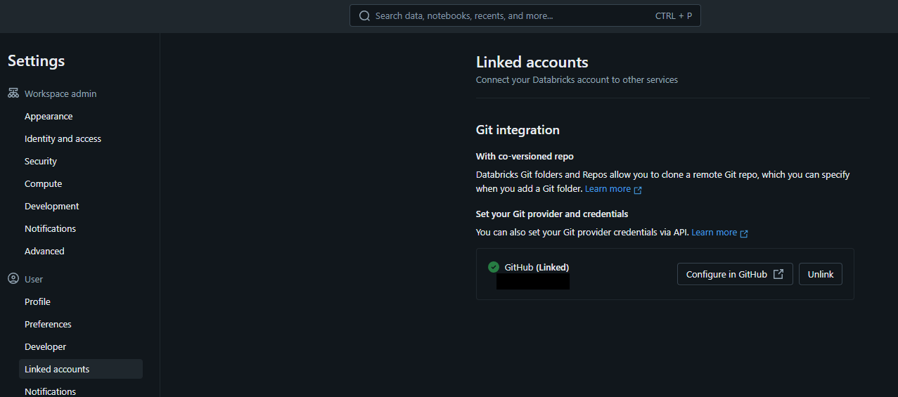

## Databricks Bootcamp

This project has been created with the objective of practicing spark in one of the most known data platforms, Databricks.

The following concepts are going to be practiced:

    ✅ How to connect your databricks workspace on github.
    ✅ How to securely keep your secrets and work with .env
    ✅ How to connect on different datasources and save your dataframe 
    ✅ How you can automate the data extraction to a bronze layer
    ✅ How you can easily automate your silver and gold layer with workflows
    ✅ Some SQL concepts such as views, create tables, etc.

    ⚠️ This project was all built using Databricks free edition, for this reason I have not applied delta live tables for streaming, if you want to practice this concept then I have left a code example but keep in mind this is very expensive.

## 1 - Connecting your Databricks with your Git Repo

In this session I am briefly explainin how you'll connect your git repo in your databricks. Previously for community edition this was not possible but since the launch of the Free Edition we have now several additional features which previous was not available and the connection with GH is one of those.

1 - On the top right corner under your initial you'll see an option "settings", click there and then in Linked Accounts



2 - This will guide you the step by step which will end with you giving the necessary permissions so Databricks can read and push data into your repo

## 2 - Keeping your passwords secure

There are different ways of setting up your passwords, in a paid version for example we have the possibility to add our secrets directly in our cluster, from the UI which simplifies. In the free version this is not possible so we need to do it via API. In the below steps I'll show how to get an API key, then plaving a .env file in your databricks workspace and finally running a python script to read the variables from your env file and place it in your secrets.

⚠️ This is extremelly important if you want to automate your pipelines with workflows as you'll need access to it during runtime, if you miss this step the workflow will fail with a generic error message saying.

    ERROR DriverCorral: DBFS health check failed
    Caused by: java.lang.RuntimeException: User security info not yet available

1 - Set ud a Databricks API key under Settings > Developer > Access Tokens. There you can generate an API key:

⚠️ Make sure you copy the token, as you won't be able to do this later

2 - Create an .env file to store your secrets and add it in your .gitignore, this env file will ve execute only once when you run the script to create the secrets.

3 - Create a notebook to setup the secrets, there you can install and import python-dotenv and then use the load_dotenv method like the example below:

```bash
    !pip install python-dotenv --quiet
```

And then import the libs like the example below:
```python
from dotenv import load_dotenv
import requests
import json
import os

load_dotenv()
```
4 - Once you have your notebook with the variables imported you can then make use of the ```python os.environ()``` method to bring the varibles to the execution.

5 - Then with the variable and the API Key you'll create the secrets scope

6 - Finally you'll create the necessary secrets in your environment

ℹ️ The codes were hidden in the documentation bus please refer to "Secrets Setting Notebook.py" for the full walkthrough

## 3 - Connecting with different Data Sources

Here the idea was to connect on an SQL database, an API and also an S3 bucket. The objective was simply to consume different data sources which would be gathered together.

In this readme I will not get into the technicalities of hos this can be achieved, for that you can refer to "SQL Ingestion.py" and "SQL Ingestion Delta.py" for the SQL example.

ℹ️ This was done after creating a free postgres DB on Render, I strongly recomend using Render as it is simple and fast to deploy a toy DB

For the API consumption you can refer to API Data Ingestion.py and finally for the S3 example you can refer to "Customer Ingestion.py"

⚠️ Note that the S3 example was done using my personal S3 bucked publicly available by the time this project was done but that no longer exists. The reson why I used a public S3 was to not take the risk of generating costs in my personal AWS account.

ℹ️ A very useful information is that now that you have your secrets added into databricks you can use the following code to retrieve it whenever the notebook runs (this includes in workflows)

```python
dbutils.secrets.get(scope="your_scope", key="your_variable")
```
